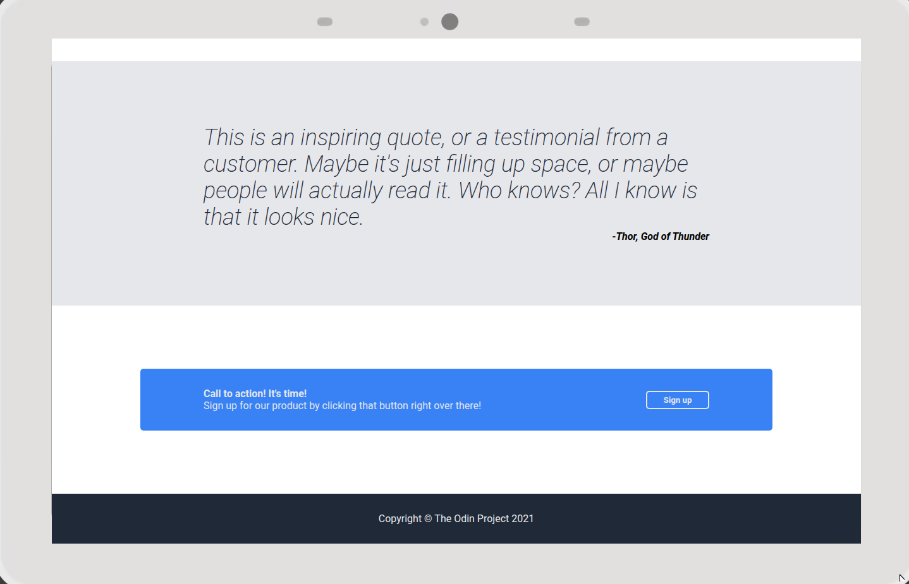
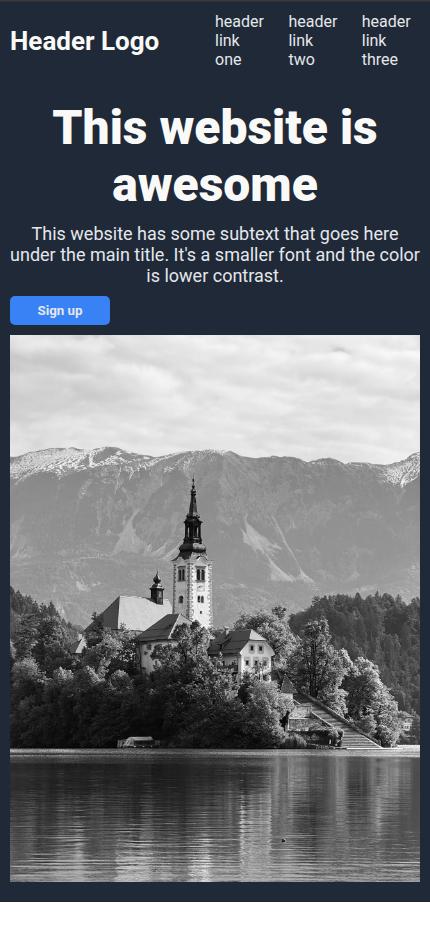

# Landing Page - Responsive Project 🌐

This repository contains the source code for a **modern and responsive Landing Page**, built with a clean design, user-friendly layout, and performance in mind.  
✅ **Live Demo**: [Click here to view the Landing Page](https://jonas-petty.github.io/Landing_Page/)

## 📸 Preview

|                                                      |                                                     |                                                      |
| ---------------------------------------------------- | --------------------------------------------------- | ---------------------------------------------------- |
|  |                                                     |  |
|   |  |   |

## ✨ Features

-   Fully responsive layout for desktop, tablet, and mobile
-   Clean and organized sections
-   Smooth scroll and hover animations
-   Semantic HTML structure
-   Modern and flexible layout
-   Well-structured and commented code

## 🛠️ Technologies Used

-   **HTML5**
-   **CSS3**

## Future Updates

<input type="checkbox" checked> HTML Structure

<input type="checkbox" checked> CSS Style

<input type="checkbox" checked> SEO

<input type="checkbox" checked> Responsive

<input type="checkbox" > Accessibility

<input type="checkbox" >Dark mode toggle

## 📬 Contact

Feel free to reach out:

-   🌐 Portfolio: [https://jonasfelix.netlify.app/](https://jonasfelix.netlify.app/)
-   💼 LinkedIn: [https://www.linkedin.com/in/jonas-felix-dev/](https://www.linkedin.com/in/jonas-felix-dev/)
-   📧 Email: [jonasfelixdesouza21@gmail.com](jonasfelixdesouza21@gmail.com)

## Images by

Photo by <a href="https://www.pexels.com/photo/bled-island-with-church-and-mountains-in-black-and-white-32347565/">Jerusha Josine</a>

Image by <a href="https://pixabay.com/users/hansa1954-6168699/?utm_source=link-attribution&utm_medium=referral&utm_campaign=image&utm_content=7923106">Hans-Martin Fabritz</a> from <a href="https://pixabay.com//?utm_source=link-attribution&utm_medium=referral&utm_campaign=image&utm_content=7923106">Pixabay</a>

Image by <a href="https://pixabay.com/users/ralf1403-21380246/?utm_source=link-attribution&utm_medium=referral&utm_campaign=image&utm_content=9536049">Ralf Ruppert</a> from <a href="https://pixabay.com//?utm_source=link-attribution&utm_medium=referral&utm_campaign=image&utm_content=9536049">Pixabay</a>

Image by <a href="https://pixabay.com/users/witchfiction-387310/?utm_source=link-attribution&utm_medium=referral&utm_campaign=image&utm_content=430441">Witch Fiction</a> from <a href="https://pixabay.com//?utm_source=link-attribution&utm_medium=referral&utm_campaign=image&utm_content=430441">Pixabay</a>

Photo by <a href="https://www.pexels.com/photo/close-up-of-cat-248280/">Pixabay</a>
